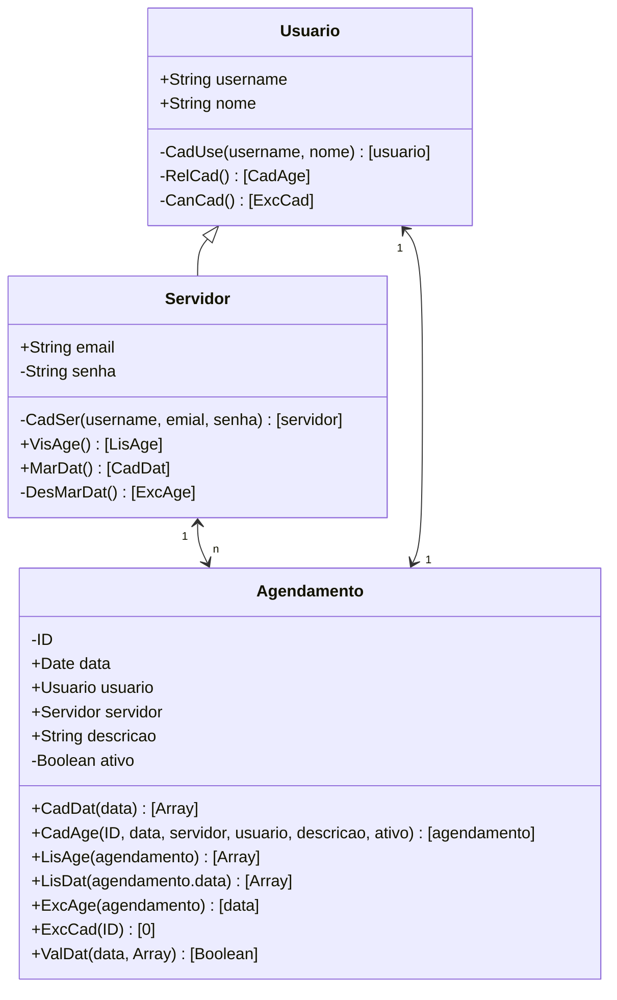

```mermaid

    classDiagram
    class Servidor
    Servidor : +String email
    Servidor : -String senha
    Servidor : -CadSer(username, emial, senha)[servidor]
    Servidor : +VisAge()[LisAge]
    Servidor : +MarDat()[CadDat]
    Servidor : -DesMarDat()[ExcAge]

    class Agendamento
    Agendamento : -ID
    Agendamento : +Date data
    Agendamento : +Usuario usuario
    Agendamento : +Servidor servidor
    Agendamento : +String descricao
    Agendamento : -Boolean ativo
    Agendamento : +CadDat(data)[Array]
    Agendamento : +CadAge(ID, data, servidor, usuario, descricao, ativo)[agendamento]
    Agendamento : +LisAge(agendamento)[Array]
    Agendamento : +LisDat(agendamento.data)[Array]
    Agendamento : +ExcAge(agendamento)[data]
    Agendamento : +ExcCad(ID)[0]
    Agendamento : +ValDat(data, Array)[Boolean]

    class Usuario
    Usuario : +String username
    Usuario : +String nome
    Usuario : -CadUse(username, nome)[usuario]
    Usuario : -RelCad()[CadAge]
    Usuario : -CanCad()[ExcCad]

    Usuario <|-- Servidor
    Servidor "1" <--> "n" Agendamento
    Usuario "1" <--> "1" Agendamento

```