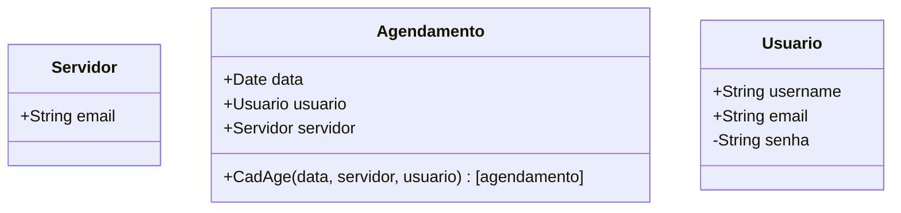

```mermaid

    classDiagram
    class Servidor
    Servidor : +String email

    class Agendamento
    Agendamento : +Date data
    Agendamento : +Usuario usuario
    Agendamento : +Servidor servidor
    Agendamento : +CadAge(data, servidor, usuario)[agendamento]

    class Usuario
    Usuario : +String username
    Usuario : +String email
    Usuario : -String senha

```