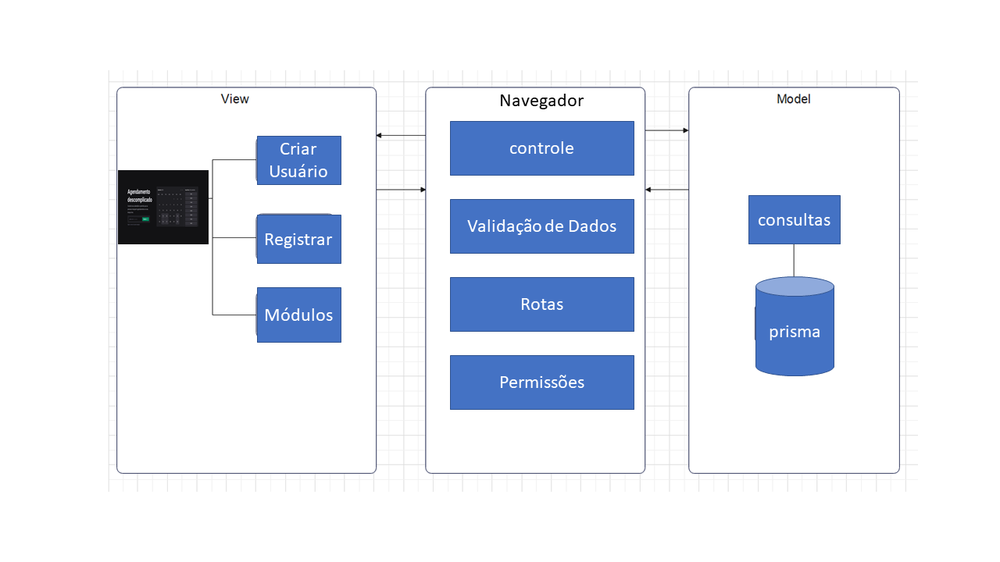

## Documento do Projeto Arquitetural do Software

Este documento descreve a arquitetura do software desenvolvido, detalhando a estrutura e os componentes principais do sistema. Para uma visão mais abrangente do projeto.

### Histórico de Versões

| Data       | Versão  | Descrição                          | Autor    |
| :--------- | :-----: | :--------------------------------: | :------- |
| 24/04/2024 | 1.0     | Documento inicial. Estabelece a base do projeto. | Felippe |
| 01/05/2024 | 1.1     | Correção de erros e ajustes iniciais. | Felippe |
| 02/06/2024 | 1.2     | Adição de novas seções e detalhes adicionais. | Felippe |
| 08/08/2024 | 1.3     | Correção e refinamento da arquitetura. | Felippe |

### Descrição do Projeto

Este documento fornece uma visão geral da arquitetura do software, com base na arquitetura Model-View-Controller (MVC). O modelo MVC é uma abordagem amplamente adotada para separar a lógica de negócios da interface do usuário e gerenciar a comunicação entre elas. A seguir, são apresentados os principais componentes da arquitetura:

#### 1. *Model (Modelo)*

- *Descrição:* O Model é responsável pela representação dos dados e pela lógica de negócios. Ele se comunica diretamente com o banco de dados para realizar operações como leitura, escrita e atualização dos dados.
- *Responsabilidades:*
  - Manter o estado dos dados.
  - Fornecer métodos para acessar e modificar os dados.
  - Validar dados e aplicar regras de negócios.
  - Notificar o Controller sobre mudanças nos dados.

#### 2. *View (Visão)*

- *Descrição:* A View é responsável pela apresentação das informações ao usuário. Ela se encarrega de renderizar a interface do usuário e exibir dados processados pelo Model.
- *Responsabilidades:*
  - Exibir dados para o usuário de forma clara e intuitiva.
  - Capturar e exibir eventos e interações do usuário.
  - Atualizar a interface em resposta às mudanças no Model.

#### 3. *Controller (Controlador/Navegador)*

- *Descrição:* O Controller atua como intermediário entre o Model e a View, processando as entradas do usuário, manipulando o Model e atualizando a View com base nas alterações dos dados. Além disso, o navegador desempenha um papel crucial no controle, pois é através dele que realizamos algumas requisições essenciais para o funcionamento do software. Por exemplo, o navegador é utilizado para solicitar permissões ao Google para acessar o Google Calendar, permitindo a marcação de horários diretamente na agenda do usuário.
  
- *Responsabilidades:*
  - Receber e processar eventos de entrada do usuário.
  - Atualizar o Model com base nas ações do usuário.
  - Atualizar a View para refletir as mudanças nos dados.
  - Coordenar a comunicação entre o Model e a View.
  - Realizar requisições através do navegador para serviços externos necessários, como a permissão para acessar o Google Calendar.
  - Garantir que o usuário conceda as permissões necessárias para que o software funcione corretamente, como a marcação de horários no Google Calendar.

### Diagrama da Arquitetura

O diagrama abaixo ilustra a interação entre os componentes do sistema e como eles se comunicam. A visualização ajuda a compreender como as responsabilidades são distribuídas e como os dados fluem através do sistema.

### Considerações Finais

A arquitetura proposta visa garantir que o sistema seja modular, escalável e de fácil manutenção. A separação clara entre Model, View e Controller permite que cada componente seja desenvolvido e testado independentemente, facilitando a evolução do sistema ao longo do tempo.
