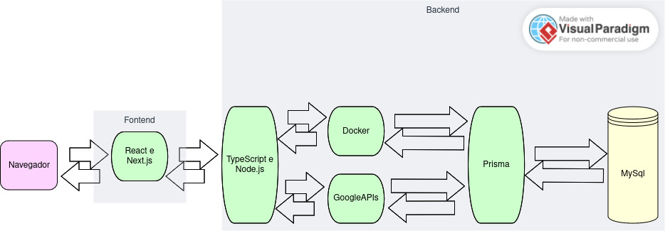

# Projeto Arquitetural do Software 

## Descrição da Aquitetura do Projeto 

O projeto será feito com JS, sendo Cliente-Servidor. Ter-ira dependencia da Google-APIs, dependente de conexão com a web, e de sincronização com as agendas dos usuários. 

## Visão Geral da Arquitetura

Imagem com arquitetura geral dos componentes da arquitetura do projeto.

## Requisitos Não-Funcionais

Requisito  | Detalhes
---------- | -------------------------------------------- 
Desempenho | 1. A página principal tem que ser carregada em no máximo 3 segundos em uma conexão mínima de 256kbps.  2. As páginas que recuperam informações de sistemas legados, devem responder em dois segundos em uma conexão de 256kbps.  3. As páginas que recuperam informações de transações no banco de dados da própria aplicação, deve responder em um segundo usando paginação real (limit e offset), retornados em uma conexão de 256kbps.  4. O servidor deve suportar 100.000 conexões simultâneas sem perda de desempenho.
Interoperabilidade | 1. Deve ser desenvolvido no sistema linux, criando uma imagem docker do sistema e com banco de dados PostgreSQL 16.

## Mecanismos arquiteturais

| Mecanismo de Análise | Mecanismo de Design  | Mecanismo de Implementação |
| -------------------- | -------------------- | -------------------------- |
| Persistência         | Banco de dados relacional | MySQL 8.0.36       |
| Camada de Dados      | Mapeamento OR             | Prisma           |
| Frontend  | Interface Usuário | Next.js, HTML5|
| Backend              | REST                  | Node.js, TypeScript    |
| Build                | Imagem Docker            | Docker e Dockerfile    |
| Deploy               | Container Docker         | Docker compose         |

## Implantação

### Configuração do Servidor Web e Aplicação

Frontend (Next.js e TypeScript): A aplicação Next.js, sendo uma aplicação Universal (SSR - Server-Side Rendering), precisa de um servidor Node.js para renderizar as páginas no servidor antes de enviá-las ao navegador do cliente. Esta aplicação pode ser containerizada usando Docker, permitindo fácil implantação e escalabilidade.

Backend (APIs Next.js e Google APIs): As rotas de API do Next.js, que também servirão as solicitações para as Google APIs, estarão hospedadas no mesmo servidor Node.js que o frontend. Essas APIs gerenciam a lógica de negócios, incluindo interações com o banco de dados e comunicações com serviços de terceiros (como o Google Calendar).

### Banco de Dados (MySQL)

O MySQL deve ser hospedado em um servidor dedicado ou instância de banco de dados gerenciada para garantir desempenho e segurança. Usar serviços de banco de dados gerenciados, como o Amazon RDS ou o Google Cloud SQL, pode simplificar a manutenção, realizar backups automáticos e escalar recursos conforme necessário.

### Serviços de Terceiros (Google APIs)

As Google APIs serão acessadas remotamente pela aplicação. Não há necessidade de configuração física local para estas APIs, mas deve-se garantir que a aplicação tenha as credenciais apropriadas e esteja em conformidade com as cotas e limites de uso.

### Docker e Docker Compose

Cada componente da aplicação (aplicação Next.js, servidor de API, servidor MySQL) deve ser containerizado utilizando Docker. O Docker Compose pode ser usado para definir e gerenciar os serviços como um stack, simplificando a implantação e a configuração do ambiente de produção.

### Considerações de Implantação

* Escalabilidade: A aplicação deve ser projetada para escalar horizontalmente, adicionando mais instâncias conforme necessário. Serviços como Kubernetes podem ser usados para gerenciar a escalabilidade automática dos containers Docker.

* Balanceamento de Carga: Um balanceador de carga deve ser utilizado para distribuir as solicitações de entrada entre as instâncias da aplicação, melhorando a performance e a disponibilidade.

* Segurança: Deve-se implementar práticas de segurança, como a utilização de HTTPS, firewalls, redes virtuais privadas e políticas de acesso restrito para proteger os componentes da aplicação.

* Monitoramento e Logging: Ferramentas de monitoramento e logging devem ser implementadas para acompanhar a saúde da aplicação, o desempenho e para diagnosticar problemas rapidamente.