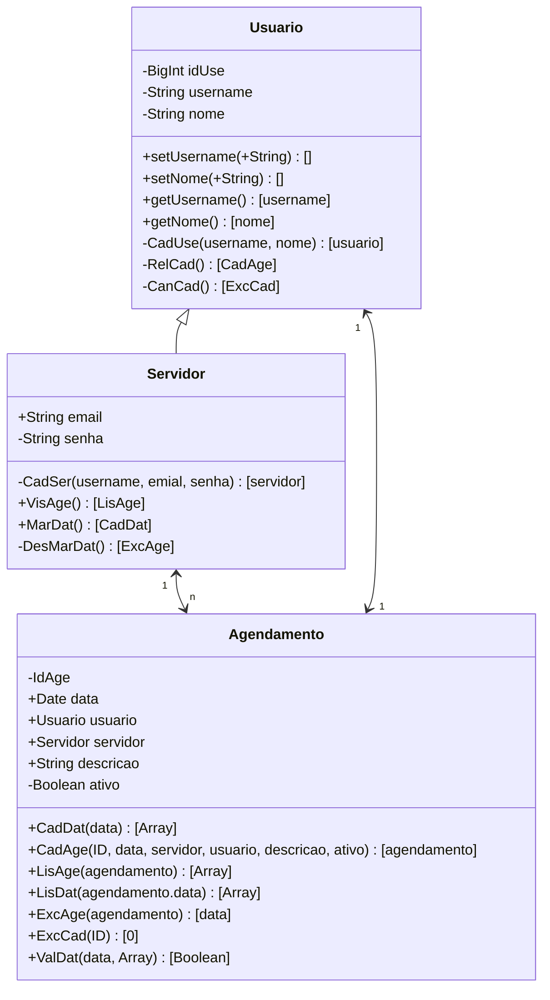

# Diagrama de Classes (UML)

# Dicionário de Dados

## Tabela Usuário

|Campo|Tipo de Dados|Descrição|Restrições|Exemplos|
|-|-|-|-|-|
|idUse|INT|Identificador unico para cada usuário|Chave primaria não nula|54|
|username|VARCHAR(100)|Nome de usuário do usuário|Único, Não nulo|geeg25|
|nome|VARCHAR(100)|Nome completo do usuário|Não nulo|Gedson Fernandes|

### Metadados

Nível de acesso: Dados sensíveis, acesso restrito a gestores de conta e equipe de suporte.

### Descrição 

A tabela 'Usuário' é ultilizada para manter informações dos usuários do sistemas. Ela serve para as operações de suporte. Cada registro na tabela representa um usuário único.

### Utilização

**Suporte**: Para acesssar rapidamente as infromações do cliente durante as interações de suporte, melhorando a experiência do usuário.

## Tabela Servidor

### Metadados

### Descrição

### Ultilização