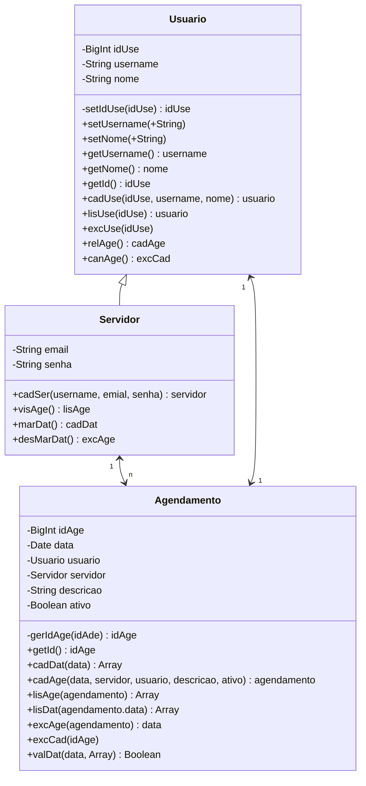

# Diagrama de Classes (UML)

# Dicionário de Dados

## Tabela Usuário

|Campo|Tipo de Dados|Descrição|Restrições|Exemplos|
|-|-|-|-|-|
|idUse|INT|Identificador único para cada usuário|Chave primaria não nula|54|
|username|VARCHAR(100)|Nome de usuário do usuário|Único, Não nulo|geeg25|
|nome|VARCHAR(100)|Nome completo do usuário|Não nulo|Gedson Fernandes|

### Métodos

* cadUse(): Cadastra o usuário.

* lisUse(): Exibe um usuário, de acordo com o idUse solicitado.

* excUse(): Deleta usuário.

* relAge(): Realizar agendamento, chamando a função de cadastrar agendamento.

* cadAge(): Cancelar agendamento, chamando a função de exluir agendamento.

### Metadados

Nível de acesso: Dados sensíveis, acesso restrito a gestores de conta e equipe de suporte.

### Descrição 

A tabela 'Usuário' é ultilizada para manter informações dos usuários do sistemas. Ela serve para as operações de suporte. Cada registro na tabela representa um usuário único.

### Utilização

**Suporte**: Para acesssar rapidamente as infromações do cliente durante as interações de suporte, melhorando a experiência do usuário.

## Tabela Servidor

|Campo|Tipo de Dados|Descrição|Restrições|Exemplos|
|-|-|-|-|-|
|email|VARCHAR(100)|Endereço de e-mail para usuário|Único, Não nulo|ged@gmail.com|
|senha|VARCHAR(100)|Senha para o usuário|Não nulo|12345678|

### Métodos

* cadSer(): Cadastra um servidor.

* visAge(): Visualiza os agendamentos.

* marDat(): Cadastra uma data disponivel para o agendamento.

* desMarDat(): Desativa uma data já cadastrada.

### Metadados

Nível de acesso: Dados sensíveis, acesso restrito a gestores de conta e equipe de suporte.

### Descrição 

A tabela 'Usuário' é ultilizada para manter informações dos usuários do sistemas. Ela serve para as operações de suporte. Cada registro na tabela representa um usuário único.

### Utilização

**Suporte**: Para acesssar rapidamente as infromações do cliente durante as interações de suporte, melhorando a experiência do usuário.

## Tabela Agendamento

|Campo|Tipo de Dados|Descrição|Restrições|Exemplos|
|-|-|-|-|-|
|idAge|INT|Identificador único para cada agendamento|Chave primaria não nula|5768|
|data|VARCHAR(12)|Hórario único para cada agendamento|Único, Não nulo|12/12/24|
|usuario|USUARIO|Um úsuario, que vai consumir algum serviço|Único, Não nulo|geeg25|
|seridor|SERVIDOR|Um servidor, que vai pestar algum serviço|Único, Não nulo|feef23|
|descricao|VARCHAR(120)|Descrição sobre detalhes do agendamento|Não nulo|Planejamento da ceia de natal|
|ativo|BOOLEAN|Verificador se o agendamento ainda está marcado|Indicador não nulo|1|

### Metadados

Nível de acesso: Dados sensíveis, acesso restrito a gestores de conta e equipe de suporte.

### Descrição 

A tabela 'Agendamento' é ultilizada para manter informações dos agendamentos do sistemas. Ela serve para as operações de suporte. Cada registro na tabela representa um agendamento único.

### Utilização

**Suporte**: Para acesssar rapidamente as infromações do cliente durante as interações de suporte, melhorando a experiência do usuário.
